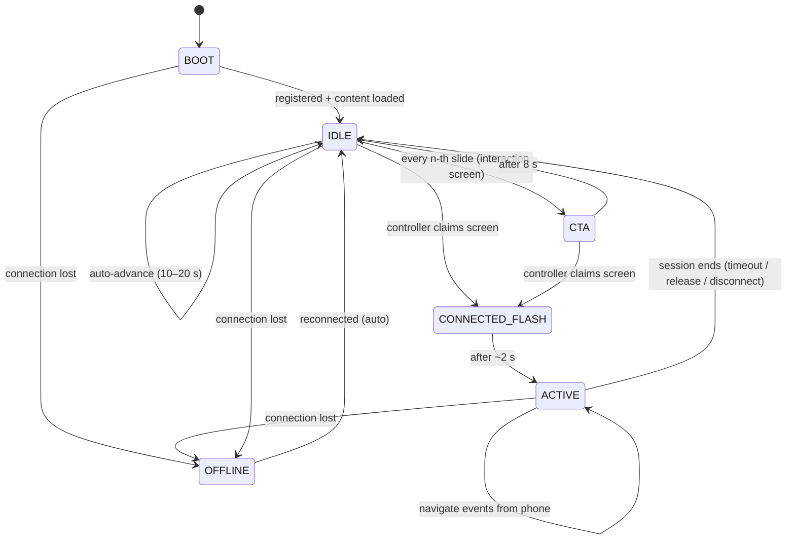
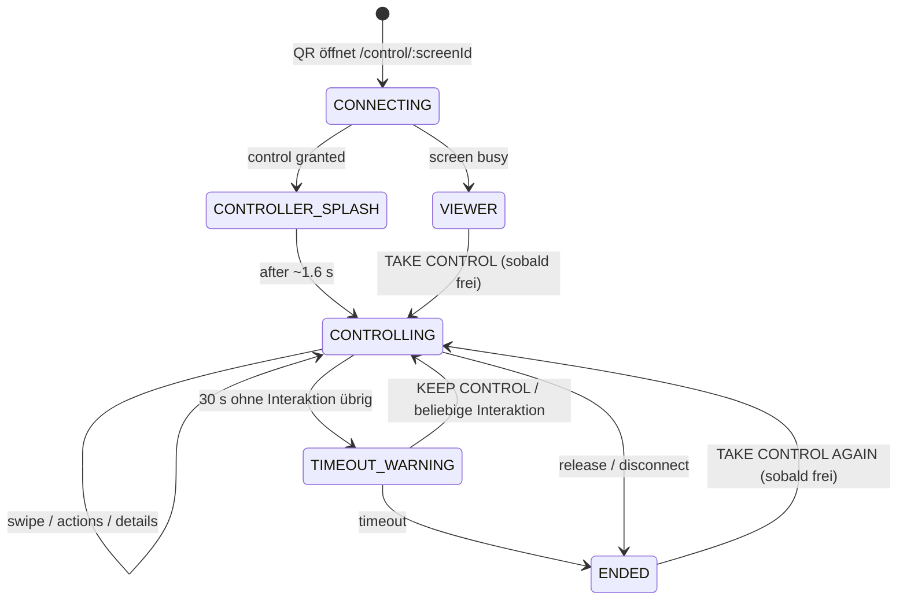
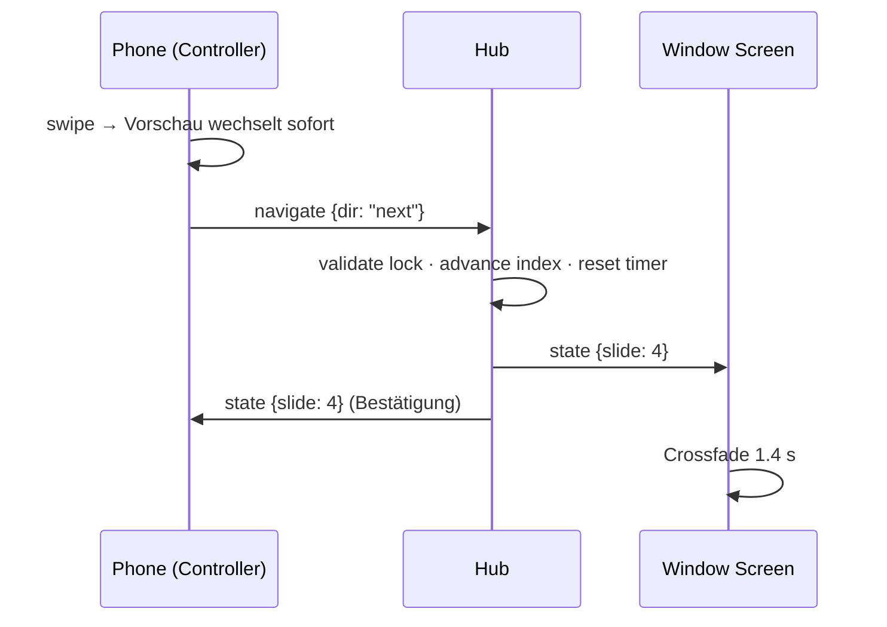

# INTERACTIVE GALLERY WINDOW

**PUBLIC SCREEN. PRIVATE CONTROL.**

Ein Schaufenster wird zur Bühne. Ein großer Screen zeigt Kunst — kuratiert, kinematografisch, ohne sichtbare UI. Wer davorsteht, scannt einen QR-Code und übernimmt die Kontrolle: Das eigene Smartphone wird zur Fernbedienung der Galerie. Keine App. Keine Registrierung. **Scan → Connect → Control.**

> The Window creates desire. The Phone creates interaction.

Dieses Dokument ist das vollständige UX- und Technik-Konzept. Der zugehörige Prototyp liegt im selben Repository (siehe [README.md](README.md)).

---

## 00 · Essenz

Das System besteht bewusst aus **zwei Interfaces mit zwei Rollen**:

| | Gallery Window Screen | Smartphone Controller |
|---|---|---|
| Rolle | Inszenierung | Interaktion |
| Charakter | emotional, kinematografisch | funktional, persönlich |
| Inhalt | Artwork, große Typografie, fast nichts sonst | Details, Aktionen, Anfragen |
| Sichtbarkeit | öffentlich (Straße) | privat (Hand) |
| UI-Dichte | minimal | reduziert, aber vollständig |

Der Screen ist **kein zweiter Monitor des Smartphones**. Persönliches (Name, E-Mail, Preisanfrage) erscheint niemals auf dem öffentlichen Screen. Der Screen kennt nur zwei Zustände: Kunst zeigen und — kurz — zur Interaktion einladen.

Und: **The window never closes.** Nachts, sonntags, an Feiertagen läuft die Ausstellung weiter. Aus Laufkundschaft wird Interaktion, aus Interaktion werden Leads — messbar, rund um die Uhr.

---

## 01 · User Journey

**STEP 01 — Attract.**
Ein Passant geht vorbei. Auf dem Screen: ein Werk, bildschirmfüllend, langsame Bewegung, ruhige Wechsel. In der Ecke, klein wie ein Galerie-Wandlabel: ein QR-Code mit `TAKE CONTROL — Scan to explore.` Alle paar Werke übernimmt für wenige Sekunden ein Interaction Screen die volle Fläche: `DON'T JUST LOOK. TAKE CONTROL.`

**STEP 02 — Scan.**
QR-Code scannen, mobiler Browser öffnet sich. Keine App, kein Login, kein Cookie-Theater. Ladezeit unter zwei Sekunden, dunkler Screen, das erste, was man liest:

**STEP 03 — Connect.**
`YOU'RE IN CONTROL` — das Smartphone ist mit genau diesem Fenster verbunden (die Screen-ID steckt in der URL). Auf dem großen Screen erscheint kurz `CONNECTED`, dann wieder das Werk. Keine Namen, keine persönlichen Daten auf dem Glas.

**STEP 04 — Control.**
Swipe links/rechts (oder ← / →): Das Werk wechselt **sofort** auf dem großen Screen — Ziel < 300 ms wahrgenommene Latenz. Die Transition ist ein ruhiger Crossfade, keine App-Animation. Das Smartphone zeigt dasselbe Werk als Vorschau mit allen Informationen.

**STEP 05 — Explore.**
Auf dem Phone: `ABOUT` · `ARTIST` · `INSTAGRAM` · `REQUEST PRICE` · `SAVE`. Der Screen bleibt still — er zeigt Kunst.

**STEP 06 — Act.**
`REQUEST PRICE` öffnet ein reduziertes Formular: *Interested in this work?* — Name, E-Mail, optional Nachricht. Werk und Künstler werden der Anfrage automatisch zugeordnet. Absenden, fertig: *Thank you. The gallery will be in touch.*

**STEP 07 — Release.**
60–120 Sekunden Inaktivität beenden die Session (mit Vorwarnung: *Still exploring?* → `KEEP CONTROL`). Der Screen kehrt in den automatischen Gallery Mode zurück. Das Fenster gehört wieder allen.

---

## 02 · Screen States



| State | Verhalten | Sichtbare Elemente |
|---|---|---|
| `BOOT` | lädt Playlist, registriert sich beim Realtime-Hub | schwarzer Screen, Wortmarke |
| `IDLE` | automatische Ausstellung, Wechsel alle 10–20 s, langsamer Ken-Burns-Zoom | Artwork · Caption (Artist, Titel, Jahr) · Werk-Index `03 — 05` · kleines QR-Label · hairline Fortschrittslinie |
| `CTA` | Interaction Screen als vollwertige „Folie" im Loop (Artwork → Artwork → Artwork → CTA → …) | `DON'T JUST LOOK. TAKE CONTROL.` · großer QR · `Scan to explore the gallery.` |
| `CONNECTED_FLASH` | kurze Bestätigung bei Verbindungsaufbau | nur das Wort `CONNECTED` |
| `ACTIVE` | Phone steuert; kein Auto-Advance; QR-Label weicht dezentem `LIVE`-Indikator (andere sollen nicht „reinfunken", können aber via QR als Viewer einsteigen) | Artwork · Caption · Index · `LIVE` |
| `OFFLINE` | Realtime-Verbindung weg → lokaler Fallback-Loop läuft weiter (das Fenster bleibt nie schwarz), Auto-Reconnect | Artwork-Loop · Mikro-Statuspunkt |

Grundsatz: Der Screen ist **immer bespielt**. Es gibt keinen Zustand, in dem das Fenster Fehlermeldungen, Browser-UI oder Leere zeigt.

---

## 03 · Smartphone States



| State | Copy & Verhalten |
|---|---|
| `CONNECTING` | Wortmarke, dezenter Puls. Unter 2 s. |
| `CONTROLLER_SPLASH` | `YOU'RE IN CONTROL` — ein Moment Stolz, dann automatisch weiter. |
| `CONTROLLING` | Artwork-Vorschau (swipebar) · ← → · Caption · Aktionszeilen · Live-Punkt „Connected to Window 01". Jede Interaktion heartbeatet die Session. |
| `VIEWER` | Banner: *Someone is currently exploring the window.* Darunter das volle Erlebnis **lokal** (eigenes Durchblättern, Details, Anfragen — ohne den großen Screen zu bewegen). Wird die Kontrolle frei: Banner wird zu `TAKE CONTROL`. |
| `TIMEOUT_WARNING` | Overlay unten: *Still exploring?* → `KEEP CONTROL`. |
| `ENDED` | *Session ended. The window returned to the exhibition.* → `TAKE CONTROL AGAIN` (nur wenn frei). Gespeicherte Werke & Details bleiben nutzbar. |

Personenbezogenes (Formulare, gespeicherte Werke) existiert ausschließlich auf dem Phone.

---

## 04 · Interaction Logic

**Input → Output-Mapping (Controller):**

| Geste / Aktion | Phone | Screen |
|---|---|---|
| Swipe ← / → oder Buttons | Vorschau wechselt sofort (optimistic) | Crossfade zum Werk, < 300 ms nach Geste |
| `ABOUT` / `ARTIST` aufklappen | Accordion | — (Screen bleibt ruhig) |
| `INSTAGRAM` | öffnet Profil in neuem Tab | — |
| `REQUEST PRICE` | Bottom Sheet mit Formular | — (niemals!) |
| `SAVE` | lokal gespeichert, Toast | — |
| Inaktivität | Warnung → Session-Ende | zurück in IDLE |

**Prinzipien:**

1. **Optimistic UI:** Das Phone wechselt sofort, der Server bestätigt mit autoritativem State. Bei Konflikt gewinnt der Server (single source of truth).
2. **Ein Verb pro Screen-Moment:** Der große Screen reagiert nur auf Navigation. Alles andere ist Phone-only.
3. **Interaktion = Heartbeat:** Jede Geste verlängert die Session implizit.
4. **Keine Modi auf dem Screen:** Der Screen erklärt nichts, er zeigt. Erklärung, Zustand, Fehler — alles wohnt auf dem Phone.

---

## 05 · Session Logic

- Session entsteht beim Öffnen von `/control/:screenId` (anonyme `sessionId`, kein Login).
- **Control Claim:** Der erste verbundene Controller erhält die Kontrolle (Server-vergeben, atomar).
- **Inactivity Timeout:** 75 s (konfigurierbar 60–120 s). Timer resettet bei jeder Interaktion.
- **Warning:** 30 s vor Ende → Phone zeigt *Still exploring?* / `KEEP CONTROL`.
- **Ende** durch: Timeout · Tab-Schließen/Disconnect · explizites Verlassen.
- **Nach dem Ende:** Server broadcastet Freigabe → Screen zurück in `IDLE`, wartende Viewer sehen `TAKE CONTROL`. Session-Dauer wird als Event geloggt.
- **Grace bei Reconnect:** Kurzer WS-Abriss (Phone-Lock) beendet die Session serverseitig sofort (MVP-Einfachheit); das Phone re-claimt automatisch, wenn die Kontrolle noch frei ist. Post-MVP: 10 s Grace-Period, in der der Claim reserviert bleibt.

---

## 06 · Multi-User Behaviour

**MVP — „First come, first control":**

- Nutzer 1 scannt → Controller.
- Nutzer 2 scannt währenddessen → Viewer: *Someone is currently exploring the window.* + volles lokales Erlebnis (*Explore on your phone*). Alle Aktionen (About, Instagram, Price Request, Save) funktionieren auch als Viewer — nur der große Screen gehorcht ihnen nicht.
- Wird die Kontrolle frei, erscheint bei allen Viewern in Echtzeit `TAKE CONTROL`.

**Später — Queue:**

- Position im Wartestand: *You're next.* / *2 people ahead of you.*
- Sanftes Handover: 10-Sekunden-Countdown auf dem Phone des Nächsten.
- Kuratierte Kollisionsvermeidung: max. Sessionlänge (z. B. 3 min), wenn andere warten.

Der öffentliche Screen zeigt in keinem Fall, *wer* steuert — nur *dass* gesteuert wird (`LIVE`).

---

## 07 · Realtime Architecture

```
┌─────────────────┐         WebSocket          ┌──────────────────┐
│  WINDOW SCREEN  │ ◄────────────────────────► │                  │
│  (Kiosk-Browser)│   state / show / flash     │                  │
└─────────────────┘                            │   REALTIME HUB   │
                                               │  (Node.js + ws)  │
┌─────────────────┐         WebSocket          │                  │
│  PHONE #1       │ ◄────────────────────────► │  · screen state  │
│  (Controller)   │   claim / navigate / hb    │  · control lock  │
└─────────────────┘                            │  · session timer │
                                               │  · idle rotation │
┌─────────────────┐         WebSocket          │  · event log     │
│  PHONE #2…n     │ ◄────────────────────────► │                  │
│  (Viewer)       │   state (read-only)        └────────┬─────────┘
└─────────────────┘                                     │ REST
                                                        ▼
                                          content · leads · analytics
```

**Warum ein eigener Hub (Node + `ws`) statt Fertiglösung?** Der Server ist nicht nur Message-Relay, sondern **Besitzer der Wahrheit**: Er vergibt den Control-Lock atomar, führt Session-Timer, treibt die Idle-Rotation und loggt Events — Logik, die man bei Supabase Realtime/Pusher/Ably doch wieder in eine Edge Function auslagern müsste. Für einen Screen + eine Handvoll Phones ist ein einzelner Node-Prozess die robusteste, am einfachsten zu betreibende Lösung. (Skalierungspfad: siehe unten.)

**Message-Protokoll (JSON über WS):**

| Richtung | Message | Zweck |
|---|---|---|
| Client → Hub | `hello {role, screenId, sessionId}` | Registrierung |
| Hub → Client | `init {slide, mode, hasController, you}` | Startzustand |
| Phone → Hub | `claim` | Kontrolle anfordern |
| Hub → Phone | `role {controller\|viewer, timeoutMs}` | Rollenzuweisung |
| Phone → Hub | `navigate {dir}` / `goto {index}` | Werkwechsel |
| Hub → Alle | `state {mode, slide, hasController}` | autoritative Sync |
| Phone → Hub | `heartbeat` | Session verlängern (implizit bei jeder Aktion) |
| Hub → Phone | `warning {secondsLeft}` | Timeout-Vorwarnung |
| Hub → Alle | `control-available` | Kontrolle wieder frei |
| Phone → Hub | `release` | Kontrolle abgeben |
| Phone → Hub | `track {event, props}` | Analytics |

**Sequenz „Swipe → Werkwechsel":**



**Resilienz:** Beide Clients reconnecten mit Backoff (1 → 8 s). Der Screen fällt bei Hub-Verlust auf einen lokalen Rotations-Loop zurück — die Ausstellung läuft optisch weiter. IDs statt Indizes wären ab Playlist-Editierbarkeit die stabilere Referenz (Post-MVP).

---

## 08 · Suggested Tech Stack

| Layer | MVP (dieser Prototyp) | Begründung | Später |
|---|---|---|---|
| Screen-App | Vanilla JS, eine HTML-Seite, Kiosk-Fullscreen | 24/7-Betrieb: keine Build-Chain, kein Framework-Risiko, sofort debugbar | bleibt — oder Next.js, wenn CMS-SSR gewünscht |
| Phone-App | Vanilla JS, mobile Web (PWA-ready) | Ladezeit < 2 s entscheidet über die Conversion an der Scheibe | PWA-Manifest, Push |
| Realtime | Node.js + `ws` (ein Prozess, in-memory State) | Lock/Timer/Rotation gehören auf den Server; minimale Latenz | Redis-backed State, mehrere Nodes, oder Supabase Realtime + Edge Functions |
| Content | JSON-Dateien (`content/`) | versionierbar, diffbar, für 5–50 Werke völlig ausreichend | Headless CMS (Sanity/Payload/Directus): Artists, Artworks, Screens, Playlists, Leads |
| Leads/Analytics | JSONL-Append auf Disk + `/api/stats` | null Infrastruktur, DSGVO-freundlich (Daten bleiben im Haus) | Postgres + Dashboard, CRM-Anbindung |
| QR | serverseitig generiertes SVG pro Screen | URL enthält Screen-ID + `?src=qr` (Attribution) | NFC-Tag mit derselben URL |
| Hosting | ein kleiner VPS / Mac mini im Haus | Screen und Hub im selben LAN → minimale Latenz | Cloud (Fly.io/Railway/Hetzner), TLS via Caddy |
| Screen-Hardware | beliebiger Player mit Chrome/Chromium im Kiosk-Modus | — | High-Brightness-Schaufensterdisplay (2 500+ nits), Portrait |

**Betriebsnotizen (Schaufenster-Realität):** Kiosk-Autostart nach Stromausfall, tägliche Auto-Reload-Fenster (z. B. 05:00), Wake Lock, Helligkeit nach Tageszeit, Fonts self-hosted für Offline-Robustheit, HTTPS Pflicht (Kamera-Scan + `navigator.share` + PWA verlangen Secure Context).

---

## 09 · Content Model

```
Artist            Artwork                    Screen                Playlist
──────            ───────                    ──────                ────────
id                id                         id (z. B. gallery-    id
name              artistId                   hamburg-window-01)    name
bio               title                      label                 artworkIds[] (kuratierte
instagram         year                       gallery               Reihenfolge)
url               medium                     location
                  dimensions                 playlistId ──────────►
                  image (+ srcset später)    idleDwellMs
                  description                ctaEvery
                  price | priceOnRequest     theme (dark/light)
                  available
                  sortOrder

Lead / Request                     Event
──────────────                     ─────
id, ts                             ts
screenId, sessionId                screenId, sessionId, role
artworkId, artistId  (auto)        event (siehe Taxonomie)
name, email, message               props {artworkId, dir, …}
status (new/contacted/closed)
```

Im Prototyp: `content/artworks.json` + `content/screens.json`. Die Struktur ist 1:1 in ein Headless CMS überführbar — ein Screen referenziert eine Playlist, eine Playlist referenziert Werke, Werke referenzieren Artists. Leads und Events sind append-only.

**Event-Taxonomie (MVP):** `screen_view` · `qr_scan` · `session_started` · `control_claimed` · `artwork_viewed` · `artwork_changed` · `artist_opened` · `instagram_clicked` · `price_requested` · `artwork_saved` · `contact_started` · `control_released` · `session_ended {duration}`.

Damit beantwortbar: Welche Werke halten Aufmerksamkeit? Welche führen zu Anfragen? Wann ist das Fenster lebendig? Wie lang sind Sessions?

---

## 10 · Visual Design System

**Haltung:** minimalistisch · editorial · architektonisch · kinematografisch · selbstbewusst. Referenzrahmen: High-End-Galerie, Luxury Retail, Apple, Monocle, Nowness, digitale Museumsinstallation. **Nicht:** Startup, SaaS, Dashboard, gamified, bunt, over-designed.

**Farbe — Dark Canvas:**

| Token | Wert | Verwendung |
|---|---|---|
| `--bg` | `#0A0A0B` | Bühne. Fast-Schwarz, damit Schwarz im Werk tiefer bleibt |
| `--ink` | `#F2EFE9` | Warmweiß für Typo (kein hartes `#FFF`) |
| `--muted` | `ink @ 55 %` | Sekundärinfos |
| `--faint` | `ink @ 30 %` | Tertiär, Indizes |
| `--hairline` | `ink @ 14 %` | Linien, Trenner |
| `--label` | `#F2EFE9` auf Werkfläche | QR-„Wandlabel" |

Keine Akzentfarbe. **Die Farbe kommt aus dem Werk.** Ein einzelner Status-Punkt (Live/Connection) darf `#3FD68C` tragen — sonst nichts.

**Typografie:**

- Display: **Instrument Serif** (Regular + Italic) — Werktitel, große Momente (`CONNECTED`, `YOU'RE IN CONTROL`). Editorial, warm, galeriehaft.
- Grotesk: **Instrument Sans** — Labels, Captions, Aktionen. Uppercase mit weitem Tracking (`0.18–0.35 em`) für die architektonische Stimme.
- Hierarchie Screen: Artist klein/uppercase/tracked → Titel groß serif italic → Jahr/Medium klein. Headlines im CTA: `clamp(3.5rem … 9rem)`, enge Zeilenhöhe (0.95), zweizeilig gebrochen.
- Zahlen (Index `03 — 05`) mit Gedankenstrich, nie Slash — ruhiger.

**Layout:**

- Screen: Werk zentriert mit Atemraum (`contain`, nie beschnitten), Caption unten links am Grid, Index oben rechts, QR-Label unten rechts. Alles am selben Randmaß (5 vh/vw-Modul).
- Phone: eine Spalte, Werk oben, Caption, dann Aktionszeilen als hairline-getrennte Liste (kein Card-Design, keine Schatten-Buttons). Bottom Sheet für das Formular.
- Whitespace ist das Ordnungsprinzip; Trennung durch Abstand und Hairlines, nie durch Boxen.

**QR als Wandlabel:** Der Code sitzt auf einer kleinen warmweißen Fläche mit Caption-Zeile — zitiert das klassische Galerie-Wandschild und bleibt dadurch maximal scanbar (dunkle Module auf hellem Grund).

---

## 11 · Animation / Transition Behaviour

| Moment | Verhalten | Dauer / Kurve |
|---|---|---|
| Werkwechsel (Idle & Active) | Crossfade zweier Ebenen, minimaler Scale-Versatz (1.02 → 1.00) | 1 400 ms · `cubic-bezier(.16,1,.3,1)` |
| Idle-Standzeit | Ken-Burns-Zoom 1.00 → 1.045, wechselnde Origin | über volle Dwell-Zeit, linear |
| Caption | folgt dem Bild verzögert (Fade + 12 px Rise) | 700 ms · 250 ms delay |
| CTA-Interstitial | Typo-Zeilen staggered (80 ms), QR zuletzt | 900 ms gesamt |
| `CONNECTED` | Serif-Wort, Fade-in → Hold → Fade-out | 400 / 1 000 / 600 ms |
| Phone-Swipe | folgt dem Finger 1:1, Snap mit Momentum | Snap 320 ms |
| Bottom Sheet | Slide-up, Hintergrund dimmt auf 40 % | 360 ms |
| Fortschrittslinie (Idle) | 1 px, füllt über Dwell-Zeit | linear |

**Verboten:** Bounce, Parallax-Spielerei, Konfetti, Spinner (stattdessen Puls der Wortmarke), alles unter 200 ms („snappy") auf dem großen Screen — das Fenster bewegt sich **langsam und sicher**. `prefers-reduced-motion` wird respektiert (Crossfade bleibt, Zoom entfällt).

---

## 12 · MVP Scope

Genau die zwölf Kernfunktionen, nicht mehr:

1. ✅ Gallery Screen im Fullscreen/Kiosk-Modus (`/screen/:screenId`)
2. ✅ Automatischer Idle-Loop (10–20 s, konfigurierbar) mit CTA-Interstitial
3. ✅ QR-Code (serverseitig, pro Screen, mit Scan-Attribution)
4. ✅ Phone verbindet sich mit genau diesem Screen (`/control/:screenId`)
5. ✅ Phone wird Controller (Lock, `YOU'RE IN CONTROL`)
6. ✅ Previous/Next + Swipe
7. ✅ Echtzeit-Werkwechsel auf dem Screen (< 300 ms wahrgenommen)
8. ✅ Artist-/Werkinfos auf dem Phone (About, Artist)
9. ✅ Instagram-Link
10. ✅ Price Request (Formular → Lead mit Werk-/Artist-Zuordnung)
11. ✅ Session-Timeout mit Vorwarnung (`KEEP CONTROL`)
12. ✅ Rückkehr in den Idle Mode + Viewer-Handling (*Someone is exploring…*)

Dazu als Fundament (weil praktisch kostenlos): Event-Logging (JSONL) und `/api/stats`.

**Bewusst nicht im MVP:** Accounts, Queue, CMS-UI, Payments, Mehrsprachigkeit, Video, Admin-Dashboard.

---

## 13 · Future Extensions

Die Architektur hält die Türen offen (Playlist-Abstraktion, Event-Bus, Screen-Registry):

- **Content:** Video Art, Sound (auf dem Phone! — Kopfhörer statt Straßenlautsprecher), 3D/AR-Objekte, Artist Interviews, Editionsinformationen, Mehrsprachigkeit.
- **Interaktion:** Queue (*You're next.*), Voting / audience-curated Exhibitions, digitales Gästebuch, Live Artist Sessions, AI Art Guide (Fragen ans Werk — auf dem Phone).
- **Commerce:** Shop/Checkout, NFT/Digital Editions, Ticketing, Events.
- **Betrieb:** CMS mit Rollen, Multi-Screen-Orchestrierung (eine Playlist, viele Fenster, Stadt-weite „Constellation"), Remote-Monitoring, A/B-Tests von Playlists gegen Lead-Conversion.

---

## Headline-Bibliothek

Ton: kurz, selbstbewusst, editorial. Keine Ausrufezeichen, kein Marketing-Sprech.

**Attract (Screen):**
- DON'T JUST LOOK. TAKE CONTROL.
- THE WINDOW IS THE INTERFACE.
- CONTROL THE WINDOW.
- ART AFTER HOURS.
- THE GALLERY DOESN'T CLOSE.
- THE GALLERY DOESN'T END AT THE GLASS.
- ONE WINDOW. INFINITE WALLS.
- STREET SIDE. FRONT ROW.
- TONIGHT'S EXHIBITION: YOURS.

**Connect (Phone):**
- YOU'RE IN CONTROL
- YOUR PHONE. THE GALLERY.
- PUBLIC SCREEN. PRIVATE CONTROL.
- THE WINDOW IS YOURS.

**System-Momente:**
- CONNECTED · LIVE · SESSION ENDED — THE WINDOW RETURNED TO THE EXHIBITION.
- Someone is currently exploring the window. · You're next.
- Still exploring? → KEEP CONTROL
- Interested in this work? → REQUEST DETAILS

**Pitch/Meta:**
- FROM FOOT TRAFFIC TO ART INTERACTION.
- SEE IT. CONTROL IT. OWN IT.
- THE WINDOW NEVER CLOSES.
